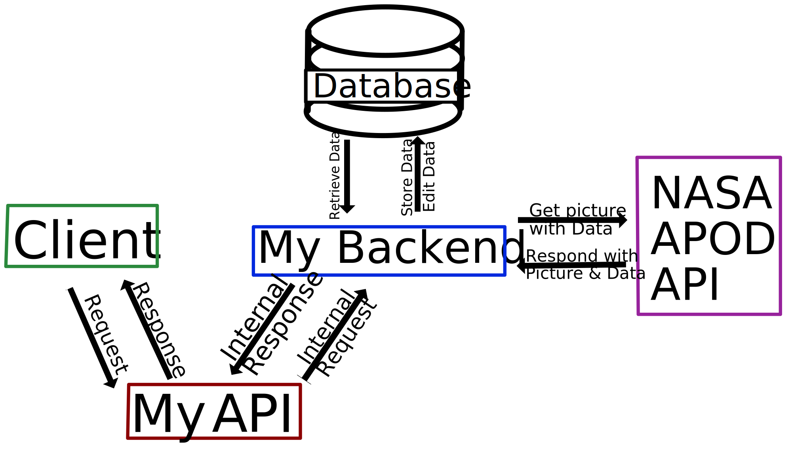

# APOD_API

An ExpressJS API for interacting with the NASA APOD system. Backend only.

The structure of the App is as follows:



Updated graphics courtesy of my wife.

Please note that a secrets file is used instead of environment variables for ease of use but I recomend setting up environment variables for additional security and hashing the password for even more.

EndPoints:

# Get a picture

To get today's picture from the app use:

```http
/picture
```

To get a picture from a specific date add a `pictureDate` parameter

```http
/picture?pictureDate=12/21/2022
```

NOTE: The expected date format is as follows:

`mm/dd/YYYY`

Anything else will result in a rejection, this may be changed in the future with advanced regex  but is out of the scope of the MVP

# Add a User

To add a user to the rating system we must provide an email for the user, Note that multiple user managment actions all use the same endpoint but use different methods.

```http
/user
```

with a body containing a `newEmail` value like below:

```json
{
    "newEmail" : "example@email.com"
}
```

NOTE: Email validation is out of the scope of the MVP but may be added in the future
