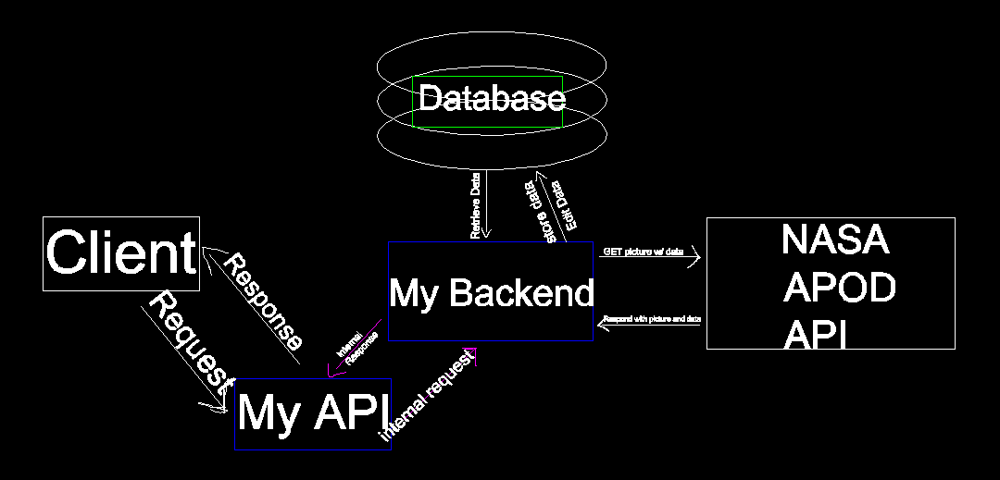

# APOD_API

An ExpressJS API for interacting with the NASA APOD system. Backend only.

The structure of the App is as follows:

(Placeholder image)

Please note that a secrets file is used instead of environment variables for ease of use but I recomend setting up environment variables for additional security and hashing the password for even more.
